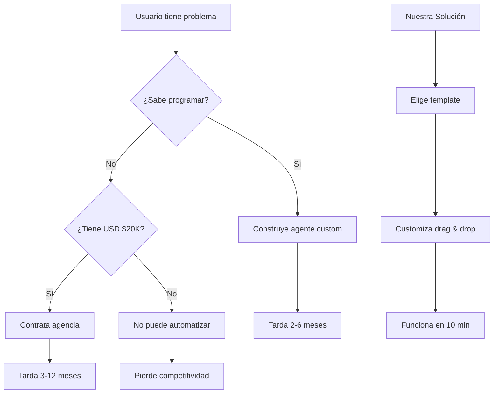

# 00 - MARCO TEÓRICO Y DECISIONES ARQUITECTÓNICAS

**Versión**: 1.0
**Fecha**: 2026-02-09
**Status**: 📘 FUNDAMENTAL - Leer antes de implementar

---

## 📋 ÍNDICE

1. [Por Qué Este Producto](#por-qu-este-producto)
2. [Problema y Solución](#problema-y-solución)
3. [Decisiones Arquitectónicas](#decisiones-arquitectónicas)
4. [Stack Tecnológico](#stack-tecnológico)
5. [Modelo de Datos](#modelo-de-datos)
6. [Principios de Diseño](#principios-de-diseño)
7. [Trade-offs Considerados](#trade-offs-considerados)

---

## 🎯 POR QUÉ ESTE PRODUCTO

### El Problema Actual

```yaml
estado_actual:
  costo_desarrollo: "USD $10,000 - $50,000 por agente custom"
  tiempo_entrega: "2-6 meses desde idea a producción"
  barrera_entrada: "Necesitas saber programar (Python/JS)"
  mantenimiento: "Requiere equipo técnico dedicado"

sufrimiento_usuario:
  non_tech: "No puedo usar esto aunque lo necesite"
  business: "Muy caro para mi pequeña empresa"
  developer: "Tengo que construir todo desde cero"
```

### La Oportunidad

```yaml
mercado:
  tam: "40M de pequeñas empresas en USA"
  sam: "8M que usan software de gestión"
  som: "800K early adopters de IA"

tendencias:
  explosion_llm: "Modelos cada vez más capaces"
  adopcion_masiva: "ChatGPT educó al mercado"
  necesidad_automatizacion: "Escasez de talento técnico"

ventana:
  timing: "Ahora o nunca - primeros movers tienen ventaja"
  competencia: "Fragmentada, sin jugador dominante"
  madurez_tecnologica: "Stack listo para producción"
```

### Nuestra Solución

```
DE: Agents especializados (código)
POR: Wrapping + No-code builder
A: App usable por cualquiera (drag & drop)

Resultado: "Shopify para Agents de IA"
```

---

## 🔄 PROBLEMA Y SOLUCIÓN

### El Ciclo de Vida del Usuario



### Propuesta de Valor

```yaml
para_usuario_non_tech:
  antes: "Imposible automatizar procesos"
  despues: "Automatizo en 10 minutos sin código"

para_desarrollador:
  antes: "Construyo todo desde cero"
  despues: "Uso templates + customizo rápido"

para_negocio:
  antes: "USD $20K + 6 meses"
  despues: "USD $29/mes + 10 minutos"
```

---

## 🏗️ DECISIONES ARQUITECTÓNICAS

### Decision 1: Arquitectura de Agents

**Opción A: Monolithic Agents**
- ✅ Simple de implementar
- ❌ Difícil de customizar
- ❌ No reutilizable

**Opción B: Modular Agents (ELEGIDA)** ✅
- ✅ Altamente reutilizable
- ✅ Fácil de customizar
- ✅ Escala mejor
- ❌ Más complejo inicialmente

**Opción C: Microservices**
- ✅ Máxima flexibilidad
- ❌ Overkill para MVP
- ❌ Demasiado complejo

**Justificación**: Modular balancea flexibilidad con complejidad manejable.

---

### Decision 2: Framework de Orquestación

**Opción A: LangChain**
- ✅ Maduro, bien documentado
- ❌ Verboso, steep learning curve

**Opción B: LangGraph (ELEGIDA)** ✅
- ✅ Visual, stateful
- ✅ Perfecto para workflows complejos
- ✅ Compatible con LangChain
- ❌ Relativamente nuevo

**Opción C: Custom desde cero**
- ✅ Control total
- ❌ Reinventar la rueda
- ❌ Sin comunidad

**Justificación**: LangGraph da lo mejor de ambos mundos - control visual + ecosistema maduro.

---

### Decision 3: Frontend Framework

**Opción A: React + Vite**
- ✅ Rápido, ligero
- ❌ Sin SSR, peor SEO

**Opción B: Next.js (ELEGIDA)** ✅
- ✅ SSR/SSG para SEO
- ✅ API Routes integradas
- ✅ Ecosistema enorme
- ✅ App Router moderno
- ❌ Curva de aprendizaje

**Opción C: Vue + Nuxt**
- ✅ Más simple que React
- ❌ Menos ecosistema
- ❌ Menos talento disponible

**Justificación**: Next.js es el estándar de facto para apps web modernas con SEO.

---

### Decision 4: Component Library

**Opción A: Material-UI**
- ✅ Completo
- ❌ Genérico, difícil de customizar

**Opción B: Chakra UI**
- ✅ Buen DX
- ❌ Menos popular que alternatives

**Opción C: shadcn/ui (ELEGIDA)** ✅
- ✅ Copia código, no npm package
- ✅ Totalmente customizable
- ✅ Basado en Radix + Tailwind
- ✅ Estética moderna
- ❌ Requiere más setup inicial

**Opción D: Tailwind desde cero**
- ✅ Máximo control
- ❌ Demasiado trabajo

**Justificación**: shadcn/ui da componentes modernos con control total sin vendor lock-in.

---

### Decision 5: Backend & API

**Opción A: REST + Express**
- ✅ Simple, universal
- ❌ Verboso, no type-safe

**Opción B: GraphQL**
- ✅ Flexible, type-safe
- ❌ Overhead de learning
- ❌ Overkill para este caso

**Opción C: tRPC (ELEGIDA)** ✅
- ✅ End-to-end type safety
- ✅ Auto-completion completa
- ✅ Zero boilerplate
- ❌ Solo para TypeScript
- ❌ Acopla frontend/backend

**Opción D: Server Actions (Next.js)**
- ✅ Nativo de Next.js
- ❌ Muy nuevo
- ❌ Less control

**Justificación**: tRPC es perfecto para stack TypeScript full - type safety sin sacrifice.

---

### Decision 6: Database

**Opción A: PostgreSQL directo**
- ✅ Control total
- ❌ Requiere hosting, backups, etc

**Opción B: MongoDB + Atlas**
- ✅ Flexible schema
- ❌ No relacional
- ❌ JOINs complicados

**Opción C: Supabase (ELEGIDA)** ✅
- ✅ PostgreSQL real
- ✅ Auth incluida
- ✅ Realtime subscriptions
- ✅ Storage incluido
- ✅ Edge functions
- ✅ Generoso free tier
- ❌ Vendor lock-in
- ❌ Edge cases complejos

**Opción D: Firebase**
- ✅ NoSQL flexible
- ❌ No relacional
- ❌ Query limitado

**Justificación**: Supabase da PostgreSQL + Auth + Realtime + Storage en un solo servicio - speed to market.

---

### Decision 7: Caching Layer

**Opción A: Redis self-hosted**
- ✅ Control total
- ❌ Operacional overhead

**Opción B: Memcached**
- ✅ Simple
- ❌ Menos features que Redis

**Opción C: Upstash Redis (ELEGIDA)** ✅
- ✅ Redis-compatible
- ✅ Serverless, pay-per-use
- ✅ Edge caching
- ✅ Generoso free tier
- ❌ Vendor lock-in

**Opción D: Cloudflare KV**
- ✅ Edge native
- ❌ Eventual consistency

**Justificación**: Upstash da poder de Redis sin overhead operacional - perfect for serverless.

---

### Decision 8: LLM Provider

**Opción A: OpenAI solamente**
- ✅ GPT-4 es poderoso
- ❌ Single point of failure
- ❌ Costoso

**Opción B: Anthropic solamente**
- ✅ Claude es excelente
- ❌ Single point of failure
- ❌ Sin imagen (a la fecha)

**Opción C: Multi-provider (ELEGIDA)** ✅
- ✅ Redundancia
- ✅ Cost optimization (GPT-3.5 para simple)
- ✅ Best tool for job
- ❌ Más complejo

**Justificación**: Multi-provider da resiliencia + optimización de costos.

---

### Decision 9: Deployment

**Opción A: AWS/GCP/Azure**
- ✅ Máximo control
- ❌ Muy complejo
- ❌ Caro para empezar

**Opción B: DigitalOcean/Vultr**
- ✅ Simple
- ❌ Manejo manual

**Opción C: Vercel (ELEGIDA)** ✅
- ✅ Zero-config deployment
- ✅ Preview deployments
- ✅ Edge functions
- ✅ Analytics incluidas
- ✅ Generoso free tier
- ❌ Vendor lock-in
- ❌ Funciones execution limit

**Opción D: Railway**
- ✅ Soporta Docker
- ❌ Menos popular que Vercel

**Justificación**: Vercel es el estándar para Next.js - speed to market sin sacrifice.

---

### Decision 10: Payment Processing

**Opción A: PayPal**
- ✅ Reconocido
- ❌ Mal developer experience

**Opción B: Paddle/Lemon Squeezy**
- ✅ Merchant of Record
- ❌ Menos flexible

**Opción C: Stripe (ELEGIDA)** ✅
- ✅ Best DX del mercado
- ✅ Ecosistema completo
- ✅ Soporta todos los casos
- ❌ Fees más altos que alternatives

**Opción D: Build your own**
- ✅ Control total
- ❌ PCI compliance nightmare

**Justificación**: Stripe es el estándar - worth every penny in time saved.

---

## 🛠️ STACK TECNOLÓGICO

### Frontend

```typescript
// Core
{
  "framework": "Next.js 14",
  "language": "TypeScript 5.3+",
  "styling": "TailwindCSS 3.4+",
  "components": "shadcn/ui + Radix UI",
  "state": "Zustand",
  "serverState": "TanStack Query (React Query)",
  "forms": "React Hook Form + Zod",
  "tables": "TanStack Table",
  "charts": "Recharts",
  "animation": "Framer Motion"
}

// DevTools
{
  "linter": "ESLint + Biome",
  "formatter": "Prettier + Biome",
  "gitHooks": "Husky + lint-staged",
  "testing": "Vitest + Playwright",
  "documentation": "Storybook"
}
```

### Backend

```typescript
// API Layer
{
  "runtime": "Node.js 20+",
  "framework": "Next.js API Routes / tRPC",
  "validation": "Zod",
  "authentication": "NextAuth.js v5",
  "authorization": "Casl"
}

// Orchestration
{
  "llmFramework": "LangChain + LangGraph",
  "vectorStore": "Pinecone / Supabase Vector",
  "memory": "Redis (Upstash)"
}

// Services
{
  "database": "Supabase (PostgreSQL)",
  "cache": "Upstash Redis",
  "storage": "Supabase Storage",
  "queue": "Inngest / BullMQ",
  "email": "Resend / SendGrid",
  "sms": "Twilio",
  "payments": "Stripe"
}
```

### Infrastructure

```yaml
hosting:
  frontend: "Vercel"
  backend: "Vercel Edge Functions"
  database: "Supabase Cloud"
  cache: "Upstash Redis"
  vector: "Pinecone Cloud"

ci_cd:
  "GitHub Actions"
  "Vercel CLI"

monitoring:
  "Vercel Analytics"
  "Sentry (errors)"
  "LogRocket (session replay)"
  "Mixpanel (events)"
```

---

## 📊 MODELO DE DATOS

### Entidades Principales

```sql
-- USUARIO
User {
  id: UUID
  email: String (unique)
  name: String
  avatar: String?
  subscription: Enum (free, pro, enterprise)
  stripeCustomerId: String?
  createdAt: DateTime
  updatedAt: DateTime
}

-- TEMPLATE (Pre-built agents)
Template {
  id: UUID
  name: String
  description: String
  category: Enum (contabilidad, marketing, hr, etc)
  blocks: JSONB [{ type, config }]
  connections: JSONB [{ from, to }]
  isPublic: Boolean
  createdBy: UUID -> User
  createdAt: DateTime
  updatedAt: DateTime
}

-- AGENTE (Instancia de template)
Agent {
  id: UUID
  userId: UUID -> User
  templateId: UUID -> Template
  name: String
  config: JSONB (overrides del template)
  status: Enum (active, paused, archived)
  createdAt: DateTime
  updatedAt: DateTime
}

-- EJECUCIÓN
Execution {
  id: UUID
  agentId: UUID -> Agent
  input: String
  output: String?
  status: Enum (pending, running, completed, failed)
  error: String?
  tokensUsed: Int
  costUsd: Decimal
  startedAt: DateTime
  completedAt: DateTime
}

-- USO
UsageLog {
  id: UUID
  userId: UUID -> User
  action: String
  resourceType: String
  resourceId: UUID
  metadata: JSONB
  createdAt: DateTime
}
```

### Relaciones

```
User 1:N Agent
User 1:N UsageLog
Template 1:N Agent
Agent 1:N Execution
```

---

## 🎨 PRINCIPIOS DE DISEÑO

### 1. Simplicidad Antes que Flexibilidad

```yaml
principio: "Es mejor tener 3 bloques que funcionan que 100 que no"
aplicacion:
  - Start con 3 tipos de bloques: LLM, Tool, Database
  - Expandir cuando haya demanda real
  - Cada nuevo bloque debe pasar prueba de necesidad
```

### 2. Progressive Disclosure

```yaml
principio: "Mostrar complejidad solo cuando se necesita"
aplicacion:
  - Usuario ve interfaz simple al inicio
  - Features avanzadas se revelan con uso
  - Power users tienen acceso a todo
```

### 3. Fail Fast, Fail Loud

```yaml
principio: "Es mejor fallar rápido que fallar silenciosamente"
aplicacion:
  - Validar inputs temprano
  - Errores claros y accionables
  - Logs extensivos para debugging
```

### 4. Default to Safe

```yaml
principio: "Las decisiones por defecto deben ser seguras"
aplicacion:
  - Límites de uso protectores
  - Cost caps prevenir sorpresas
  - Confirmación para acciones destructivas
```

### 5. Measure Everything

```yaml
principio: "No se puede optimizar lo que no se mide"
aplicacion:
  - Event tracking exhaustivo
  - Performance monitoring
  - Cost tracking por operación
```

---

## ⚖️ TRADE-OFFS CONSIDERADOS

### Trade-off 1: Tiempo de Mercado vs Perfección

**Decisión**: **Time to Market** ⏱️

```yaml
razonamiento:
  mercado: "Ventana de oportunidad NOW"
  competencia: "Primer mover advantage"
  aprendizaje: "Mejor construir algo imperfecto que nada perfecto"

estrategia:
  - MVP "good enough" en 7 semanas
  - Iterar basado en feedback real
  - Technical debt se paga después de validar
```

---

### Trade-off 2: Customización vs Simplicidad

**Decisión**: **Balance** ⚖️

```yaml
estrategia:
  - 3 templates pre-built (80% de casos)
  - Builder para customización (20% restante)
  - User elige su nivel de complejidad

ejemplo:
  novato: "Elige template → Funciona"
  intermedio: "Elige template → Modifica 2-3 cosas"
  experto: "Construye desde cero con bloques"
```

---

### Trade-off 3: Costo vs Performance

**Decisión**: **Optimización Iterativa** 🔄

```yaml
fase_1_mvp:
  - Usar mejores modelos (GPT-4, Claude Sonnet)
  - No optimizar prematuramente
  - Asumir costo inicial alto

fase_2_optimizacion:
  - Cache agresivo
  - Modelos más pequeños cuando sea posible
  - Fine-tuning de modelos específicos

fase_3_escala:
  - Modelos propios (si tiene sentido)
  - Edge computing
  - Batch processing
```

---

### Trade-off 4: Vendor Lock-in vs Speed

**Decisión**: **Vendor Lock-in Aceptado** 🔒

```yaml
razonamiento:
  velocidad: "Supabase/Vercel aceleran development 10x"
  costo_switch: "Post-mvp se puede migrar si necesario"
  complejidad: "Self-hosting es distracción"

mitigacion:
  - Abstracciones donde sea posible
  - Evitar APIs propietarias no estándar
  - Documentar decisiones para migración futura
```

---

### Trade-off 5: Features vs Usabilidad

**Decisión**: **Usabilidad Primero** 👤

```yaml
principio:
  "Es mejor 3 features que usan que 30 que nadie entiende"

aplicacion:
  - Cada feature requiere onboarding
  - Cada feature aumenta complejidad
  - Menos es más (MVP)

metrica:
  - Time to first value: < 5 minutos
  - Time to successful agent: < 10 minutos
  - Support tickets per user: < 0.1/mes
```

---

## 🚀 IMPLICACIONES DE ESTE MARCO

### Para el Equipo de Desarrollo

```yaml
frontend:
  - Seguir patrones de Next.js
  - Usar componentes de shadcn/ui sin modificar
  - TypeScript strict mode

backend:
  - tRPC para APIs nuevas
  - Zod para validación
  - Edge functions cuando sea posible

devops:
  - Todo a Vercel (todo el stack es compatible)
  - Environment variables bien documentadas
  - CI/CD desde commit #1
```

### Para el Timeline

```yaml
semanas_1_2:
  - Setup proyecto
  - Arquitectura agentes
  - Sistema de templates

semanas_3_5:
  - Frontend builder
  - Backend APIs
  - Integración Supabase

semanas_6_7:
  - Onboarding
  - Stripe integration
  - Deploy producción

semanas_8_13:
  - Iteración basada en feedback
  - Features adicionales
  - Optimización
```

### Para el Presupuesto

```yaml
costos_mensuales_estimados:
  infraestructura:
    - Vercel Pro: $20
    - Supabase Pro: $25
    - Upstash Redis: $10
    - Pinecone: $70
    - Domain: $1
    total_infra: ~$126/mes

  llm_apis:
    -假设 1000 users, 100 requests/mes c/u
    - 100K requests/mes
    - GPT-3.5 average: $0.001/request
    - total_llm: ~$100/mes初期

  total: ~$226/mes para 1000 users

  revenue:
    - 5% conversion free→pro
    - 50 paying users @ $29/mes
    - revenue: $1450/mes

  margin: ~85% (healthy)
```

---

## 📚 REFERENCIAS

### Documentación Técnica

- Next.js: https://nextjs.org/docs
- LangGraph: https://langchain-ai.github.io/langgraph/
- Supabase: https://supabase.com/docs
- tRPC: https://trpc.io/docs
- shadcn/ui: https://ui.shadcn.com

### Artículos y Resources

- "The Minimal MVP": https://medium.com/@clsavino/the-minimal-mvp-b6df53e9d52d
- "LangGraph for Agents": https://python.langchain.com/docs/langgraph
- "Supabase Auth Guide": https://supabase.com/docs/guides/auth
- "Stripe Subscriptions": https://stripe.com/docs/billing/subscriptions/overview

---

## ✅ CHECKLIST DE COMPRENSIÓN

Antes de comenzar la implementación, asegúrate de entender:

- [ ] Por qué estamos construyendo este producto
- [ ] Qué problema específico resuelve
- [ ] Quiénes son los usuarios target
- [ ] Por qué elegimos cada tecnología del stack
- [ ] Cuáles son los trade-offs aceptados
- [ ] Qué significa "time to market" en este contexto
- [ ] Cuál es el MVP mínimo viable
- [ ] Cuándo está programado el launch
- [ ] Cuánto costará operar el servicio
- [ ] Qué métricas definiran el éxito

---

**Siguiente paso**: Leer `fase-1-fabricacion-motores/README.md` y comenzar a construir los agentes base.

🎯 **Objetivo**: Terminar este marco con total claridad del "por qué" antes de pasar al "cómo".
