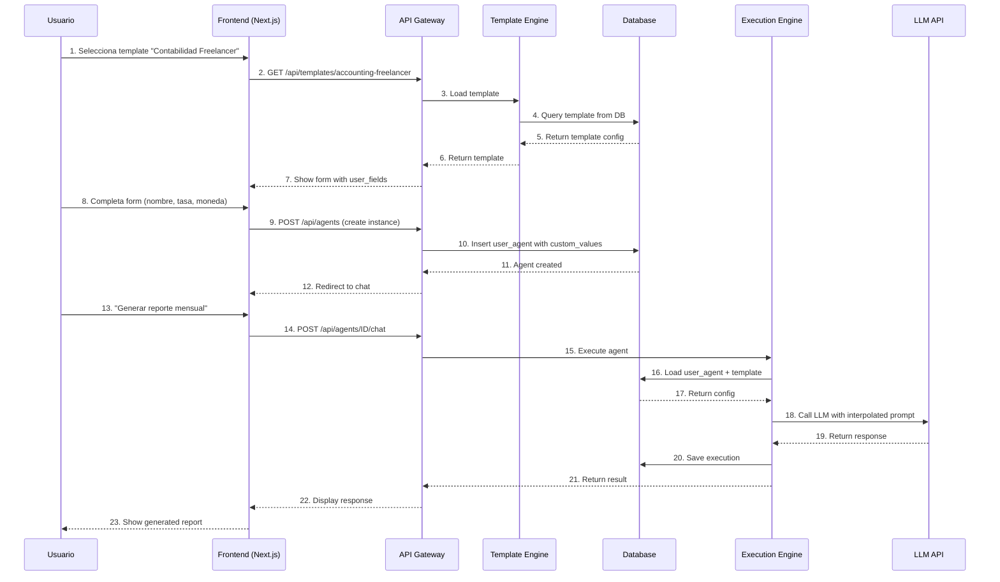

# 01 - Arquitectura Completa del Sistema

**Fecha**: 2026-02-09
**Fase**: Fundamentos
**Propósito**: Entender el sistema completo antes de construir

---

## 🎯 Metáfora Arquitectónica

### El Sistema es una Fábrica de Automóviles

```
┌─────────────────────────────────────────────────────────────┐
│  FÁBRICA DE MOTORES (Fase 1)                               │
│  - Diseñar y probar motores base                            │
│  - Contabilidad, Usuarios, etc.                             │
└─────────────────────────────────────────────────────────────┘
                           ↓
┌─────────────────────────────────────────────────────────────┐
│  LÍNEA DE ENSAMBLAJE (Fase 2)                               │
│  - Builder no-code para configurar motores                 │
│  - Marketplace de vehiculos pre-armados                     │
└─────────────────────────────────────────────────────────────┘
                           ↓
┌─────────────────────────────────────────────────────────────┐
│  CONCESIONARIO (Fase 3)                                     │
│  - Onboarding y venta                                       │
│  - Sistema de pagos                                         │
└─────────────────────────────────────────────────────────────┘
                           ↓
┌─────────────────────────────────────────────────────────────┐
│  CONDUCTOR (Fase 4)                                          │
│  - Interfaz de uso diario                                   │
│  - Dashboard, Chat, Reports                                 │
└─────────────────────────────────────────────────────────────┘
                           ↓
┌─────────────────────────────────────────────────────────────┐
│  TALLER DE SERVICIO (Fase 5)                                │
│  - Soporte, Updates, Monitoring                             │
└─────────────────────────────────────────────────────────────┘
```

---

## 🏗️ Arquitectura Técnica

### Stack Tecnológico Completo

```
┌─────────────────────────────────────────────────────────────┐
│  LAYER: CLIENTE (Frontend)                                  │
│  ─────────────────────────────────────────────────────────  │
│  - Next.js 14 (App Router, RSC)                             │
│  - shadcn/ui (Component library)                            │
│  - TailwindCSS (Styling)                                    │
│  - Zustand (State management)                               │
│  - React Query (Server state)                               │
└─────────────────────────────────────────────────────────────┘
                           ↓ REST/tRPC/WebSocket
┌─────────────────────────────────────────────────────────────┐
│  LAYER: API GATEWAY                                         │
│  ─────────────────────────────────────────────────────────  │
│  - Next.js API Routes / tRPC                                │
│  - Edge Functions (Vercel)                                  │
│  - WebSocket (Real-time)                                    │
└─────────────────────────────────────────────────────────────┘
                           ↓
┌─────────────────────────────────────────────────────────────┐
│  LAYER: SERVICIOS (Business Logic)                          │
│  ─────────────────────────────────────────────────────────  │
│  ┌─────────────┬─────────────┬─────────────┬─────────────┐ │
│  │   Agent     │  Template   │   User      │   Payment   │ │
│  │ Orchestrator│   Engine    │ Management  │   Service   │ │
│  └─────────────┴─────────────┴─────────────┴─────────────┘ │
└─────────────────────────────────────────────────────────────┘
                           ↓
┌─────────────────────────────────────────────────────────────┐
│  LAYER: DATOS (Data)                                        │
│  ─────────────────────────────────────────────────────────  │
│  - Supabase (PostgreSQL) - Primary DB                       │
│  - Upstash Redis - Cache                                    │
│  - Pinecone - Vector DB (RAG)                               │
└─────────────────────────────────────────────────────────────┘
                           ↓
┌─────────────────────────────────────────────────────────────┐
│  LAYER: EXTERNAL SERVICES                                   │
│  ─────────────────────────────────────────────────────────  │
│  - OpenAI API / Anthropic API (LLMs)                        │
│  - Banking APIs (para contabilidad)                         │
│  - Resend (Emails)                                          │
│  - Stripe (Pagos)                                           │
└─────────────────────────────────────────────────────────────┘
```

---

## 🔩 Componentes Core del Sistema

### 1. Motor de Agente (Agent Engine)

**Propósito**: "Cerebro" de cada agente especializado

**Arquitectura**:
```python
# Estructura base de un motor
class AgentMotor:
    def __init__(self, config: AgentConfig):
        self.llm = LLMProvider(config.model)
        self.tools = ToolRegistry(config.tools)
        self.memory = MemoryManager(config.memory)
        self.workflow = WorkflowBuilder(config.workflow)

    async def execute(self, input: str) -> AgentResponse:
        # 1. Procesar input
        # 2. Ejecutar workflow
        # 3. Usar tools si necesario
        # 4. Retornar resultado
        pass

# Ejemplo: Motor de Contabilidad
class AccountingMotor(AgentMotor):
    def __init__(self):
        super().__init__(
            config=AccountingConfig(
                model="gpt-4-turbo",
                tools=["invoice-parser", "calculator", "report-generator"],
                memory="vector-store"
            )
        )
```

**Configuración por JSON**:
```json
{
  "agent_id": "accounting-base",
  "name": "Motor Contable Base",
  "version": "1.0.0",
  "llm": {
    "provider": "openai",
    "model": "gpt-4-turbo",
    "temperature": 0.1,
    "max_tokens": 4000
  },
  "tools": [
    {"name": "invoice-parser", "type": "api"},
    {"name": "calculator", "type": "builtin"},
    {"name": "report-generator", "type": "document"}
  ],
  "memory": {
    "type": "vector",
    "provider": "pinecone",
    "index": "accounting-agents"
  },
  "workflow": {
    "nodes": ["input", "analyze", "process", "output"],
    "edges": [
      {"from": "input", "to": "analyze"},
      {"from": "analyze", "to": "process"},
      {"from": "process", "to": "output"}
    ]
  }
}
```

---

### 2. Template Engine (Sistema de Plantillas)

**Propósito**: Permitir customización sin código

**Arquitectura**:
```typescript
// Template base
interface AgentTemplate {
  id: string
  name: string
  description: string
  category: string

  // Configuración del agente
  agent_config: AgentConfig

  // Campos customizables por el usuario
  user_fields: TemplateField[]

  // Valores por defecto
  default_values: Record<string, any>
}

// Ejemplo: Template de Contabilidad para Freelancer
const freelancerAccountingTemplate: AgentTemplate = {
  id: "accounting-freelancer",
  name: "Contabilidad Freelancer",
  description: "Automatiza facturas, gastos e impuestos",

  agent_config: {
    motor: "accounting-base",
    specialized_instructions: "Eres experto en contabilidad para freelancers..."
  },

  user_fields: [
    {
      key: "business_name",
      type: "text",
      label: "Nombre de tu negocio",
      required: true
    },
    {
      key: "tax_rate",
      type: "number",
      label: "Tasa impositiva (%)",
      default: 21,
      required: true
    },
    {
      key: "currency",
      type: "select",
      label: "Moneda",
      options: ["USD", "EUR", "ARS"],
      default: "USD"
    }
  ],

  default_values: {
    business_name: "",
    tax_rate: 21,
    currency: "USD"
  }
}
```

---

### 3. Builder No-Code (Interfaz de Creación)

**Propósito**: UI drag & drop para customizar templates

**Arquitectura**:
```typescript
// Componente principal del Builder
export function AgentBuilder() {
  const [template, setTemplate] = useState<AgentTemplate>()
  const [selectedField, setSelectedField] = useState<TemplateField>()

  return (
    <div className="grid grid-cols-3 gap-4">
      {/* Panel Izquierdo: Campos Disponibles */}
      <FieldLibrary
        fields={AVAILABLE_FIELDS}
        onDragStart={handleDragStart}
      />

      {/* Panel Central: Canvas del Template */}
      <TemplateCanvas
        template={template}
        onDrop={handleDrop}
        onFieldSelect={setSelectedField}
      />

      {/* Panel Derecho: Propiedades */}
      <PropertyPanel
        field={selectedField}
        onUpdate={handleUpdateField}
      />
    </div>
  )
}

// Campos disponibles para arrastrar
const AVAILABLE_FIELDS = [
  {
    type: "text",
    icon: "📝",
    label: "Campo de Texto",
    description: "Para nombres, descripciones, etc."
  },
  {
    type: "number",
    icon: "🔢",
    label: "Campo Numérico",
    description: "Para tasas, montos, etc."
  },
  {
    type: "select",
    icon: "📋",
    label: "Lista Desplegable",
    description: "Para opciones predefinidas"
  },
  {
    type: "file-upload",
    icon: "📎",
    label: "Subir Archivo",
    description: "Para PDFs, imágenes, etc."
  },
  {
    type: "api-connection",
    icon: "🔗",
    label: "Conexión API",
    description: "Para conectar servicios externos"
  }
]
```

---

### 4. Execution Engine (Motor de Ejecución)

**Propósito**: Ejecutar agentes con config del usuario

**Arquitectura**:
```typescript
// Servicio de ejecución
export class AgentExecutionService {
  async executeAgent(
    agentId: string,
    userInput: string
  ): Promise<AgentResponse> {

    // 1. Obtener configuración del usuario
    const userAgent = await db.user_agents.findFirst({
      where: { id: agentId }
    })

    // 2. Cargar template base
    const template = await templateEngine.loadTemplate(
      userAgent.template_id
    )

    // 3. Combinar template + customizaciones
    const finalConfig = this.mergeConfig(
      template.agent_config,
      userAgent.custom_values
    )

    // 4. Instanciar motor con config final
    const motor = new AgentMotor(finalConfig)

    // 5. Ejecutar
    const result = await motor.execute(userInput)

    // 6. Guardar en DB
    await db.agent_executions.create({
      data: {
        agent_id: agentId,
        input: userInput,
        output: result.content,
        tokens_used: result.tokens,
        cost_usd: result.cost
      }
    })

    return result
  }

  private mergeConfig(
    baseConfig: AgentConfig,
    userValues: Record<string, any>
  ): AgentConfig {
    return {
      ...baseConfig,
      system_prompt: this.interpolatePrompt(
        baseConfig.system_prompt,
        userValues
      ),
      user_values
    }
  }
}
```

---

## 📊 Modelo de Datos

### Esquema de Base de Datos (Supabase)

```sql
-- ============================================
-- USERS: Usuarios de la plataforma
-- ============================================
CREATE TABLE users (
  id UUID PRIMARY KEY DEFAULT uuid_generate_v4(),
  email TEXT UNIQUE NOT NULL,
  name TEXT,
  subscription_tier TEXT DEFAULT 'free', -- free, pro, enterprise
  stripe_customer_id TEXT,
  created_at TIMESTAMPTZ DEFAULT NOW(),
  updated_at TIMESTAMPTZ DEFAULT NOW()
);

-- ============================================
-- TEMPLATES: Plantillas base de agentes
-- ============================================
CREATE TABLE templates (
  id UUID PRIMARY KEY DEFAULT uuid_generate_v4(),
  name TEXT NOT NULL,
  description TEXT,
  category TEXT NOT NULL, -- 'accounting', 'users', 'custom'
  agent_config JSONB NOT NULL, -- Configuración del motor
  user_fields JSONB NOT NULL, -- Campos customizables
  default_values JSONB NOT NULL, -- Valores por defecto
  is_prebuilt BOOLEAN DEFAULT false, -- Template oficial
  is_public BOOLEAN DEFAULT true, -- Visible en marketplace
  created_by UUID REFERENCES users(id),
  created_at TIMESTAMPTZ DEFAULT NOW()
);

-- ============================================
-- USER_AGENTS: Instancias de agentes por usuario
-- ============================================
CREATE TABLE user_agents (
  id UUID PRIMARY KEY DEFAULT uuid_generate_v4(),
  user_id UUID REFERENCES users(id) NOT NULL,
  template_id UUID REFERENCES templates(id) NOT NULL,
  name TEXT NOT NULL, -- Nombre personalizado
  custom_values JSONB NOT NULL, -- Valores customizados
  status TEXT DEFAULT 'active', -- active, paused, archived
  created_at TIMESTAMPTZ DEFAULT NOW(),
  updated_at TIMESTAMPTZ DEFAULT NOW(),

  UNIQUE(user_id, name)
);

-- ============================================
-- AGENT_EXECUTIONS: Historial de ejecuciones
-- ============================================
CREATE TABLE agent_executions (
  id UUID PRIMARY KEY DEFAULT uuid_generate_v4(),
  agent_id UUID REFERENCES user_agents(id) NOT NULL,
  input TEXT NOT NULL,
  output TEXT,
  status TEXT DEFAULT 'pending', -- pending, running, completed, failed
  error TEXT,
  tokens_used INTEGER DEFAULT 0,
  cost_usd DECIMAL(10, 4) DEFAULT 0,
  created_at TIMESTAMPTZ DEFAULT NOW(),
  completed_at TIMESTAMPTZ
);

-- ============================================
-- USAGE_LOGS: Logs de uso para billing
-- ============================================
CREATE TABLE usage_logs (
  id UUID PRIMARY KEY DEFAULT uuid_generate_v4(),
  user_id UUID REFERENCES users(id) NOT NULL,
  action TEXT NOT NULL, -- 'agent_execution', 'template_create', etc.
  resource_type TEXT,
  resource_id UUID,
  metadata JSONB,
  created_at TIMESTAMPTZ DEFAULT NOW()
);

-- ============================================
-- INDEXES para performance
-- ============================================
CREATE INDEX idx_user_agents_user_id ON user_agents(user_id);
CREATE INDEX idx_user_agents_template_id ON user_agents(template_id);
CREATE INDEX idx_agent_executions_agent_id ON agent_executions(agent_id);
CREATE INDEX idx_agent_executions_created_at ON agent_executions(created_at DESC);
CREATE INDEX idx_usage_logs_user_id_date ON usage_logs(user_id, created_at DESC);

-- ============================================
-- RLS (Row Level Security) para multi-tenancy
-- ============================================
ALTER TABLE user_agents ENABLE ROW LEVEL SECURITY;
CREATE POLICY user_agents_own ON user_agents
  FOR ALL
  USING (user_id = auth.uid());

ALTER TABLE agent_executions ENABLE ROW LEVEL SECURITY;
CREATE POLICY agent_executions_own ON agent_executions
  FOR ALL
  USING (
    agent_id IN (
      SELECT id FROM user_agents WHERE user_id = auth.uid()
    )
  );
```

---

## 🔄 Flujo de Datos Completo

### Ejemplo: Usuario crea y usa un agente de contabilidad



---

## 🎨 UI/UX Architecture

### Páginas Principales de la App

```
┌─────────────────────────────────────────────────────────────┐
│  / (Landing)                                                │
│  - Hero: "Tu contador autónomo 24/7"                        │
│  - Demo interactiva                                         │
│  - Pricing                                                  │
└─────────────────────────────────────────────────────────────┘

┌─────────────────────────────────────────────────────────────┐
│  /marketplace (Marketplace de Templates)                    │
│  - Grid de templates pre-armados                            │
│  - Filtros por categoría                                    │
│  - Preview de cada template                                 │
└─────────────────────────────────────────────────────────────┘

┌─────────────────────────────────────────────────────────────┐
│  /templates/[id]/setup (Setup Wizard)                       │
│  - Paso 1: Info básica                                      │
│  - Paso 2: Campos customizables                             │
│  - Paso 3: Confirmación                                     │
└─────────────────────────────────────────────────────────────┘

┌─────────────────────────────────────────────────────────────┐
│  /agents (Dashboard de Agentes)                             │
│  - Lista de agentes del usuario                             │
│  - Stats de uso                                             │
│  - Acciones rápidas                                         │
└─────────────────────────────────────────────────────────────┘

┌─────────────────────────────────────────────────────────────┐
│  /agents/[id] (Chat Interface)                              │
│  - Chat con el agente                                       │
│  - Historial de conversaciones                              │
│  - Settings del agente                                      │
└─────────────────────────────────────────────────────────────┘

┌─────────────────────────────────────────────────────────────┐
│  /settings (Cuenta y Billing)                               │
│  - Profile                                                  │
│  - Subscription                                             │
│  - Usage stats                                              │
└─────────────────────────────────────────────────────────────┘
```

---

## 🔐 Seguridad y Multi-Tenancy

### Estrategia de Seguridad

```yaml
authentication:
  provider: "Supabase Auth"
  methods: ["email/password", "magic link", "google oauth"]

authorization:
  level: "Row Level Security (RLS)"
  isolation: "Cada usuario solo ve sus agentes"

api_security:
  rate_limiting: "100 requests/minuto por usuario"
  input_validation: "Zod schemas en todos los endpoints"
  api_keys: "Rotación automática de service keys"

data_encryption:
  at_rest: "Supabase encryption por defecto"
  in_transit: "TLS 1.3"
  sensitive_fields: "Additional encryption con KMS"

cost_protection:
  max_tokens_per_request: "10,000 tokens"
  daily_budget_per_user: "$10 default"
  overspend_protection: "Hard stop en límite"
```

---

## 📈 Escalabilidad

### Estrategia de Escalado por Fases

```yaml
fase_1_0_100_users:
  infraestructura: "Vercel Hobby + Supabase Free"
  costo: "$0/mes"
  capacidad: "10K requests/día"

fase_2_100_1000_users:
  infraestructura: "Vercel Pro + Supabase Pro + Redis"
  costo: "$150/mes"
  capacidad: "100K requests/día"

fase_3_1000_10000_users:
  infraestructura: "Vercel Enterprise + Dedicated DB + Queue system"
  costo: "$1,500/mes"
  capacidad: "1M requests/día"

fase_4_10000_users:
  infraestructura: "Kubernetes + Multi-region + Edge computing"
  costo: "$10,000+/mes"
  capacidad: "10M+ requests/día"
```

---

## 🚀 Próximos Pasos

Con esta arquitectura clara, ahora puedes:

1. ✅ **Entender el sistema completo** - Big picture claro
2. ✅ **Identificar dependencias** - Qué se necesita primero
3. ✅ **Planificar implementación** - Orden lógico de construcción
4. ✅ **Comenzar Fase 1** - Fabricar los motores base

**Siguiente archivo**: `02-FASE_1_FABRICACION_MOTORES.md`

---

**Fin de Arquitectura Completa** 🏗️
