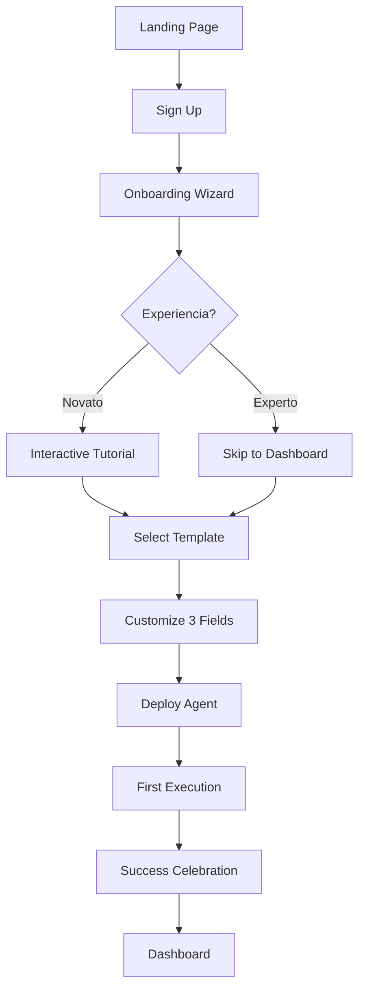

# FASE 3: DELIVERY - SISTEMA DE ENTREGA

**Duración**: 1 semana (Semana 5)
**Prioridad**: 🟡 IMPORTANTE
**Output**: Usuario puede comenzar a usar el sistema en < 10 minutos

---

## 🎯 OBJETIVO

Hacer que el producto llegue al usuario final de forma **fluida y sin fricción**.

```
Meta: Time-to-First-Value < 10 minutos
Desde: Usuario llega por primera vez
Hasta: Usuario tiene su primer agent funcionando
```

---

## 📦 ENTREGABLES

### 1. Onboarding Wizard
- ✅ Welcome screen con valor prop
- ✅ 3-step setup wizard
- ✅ Progress indicator
- ✅ Optional skip para usuarios avanzados

### 2. First Run Experience
- ✅ Template pre-seleccionado inteligente
- ✅ Interactive tour del producto
- ✅ First task guidance
- ✅ Celebration de primer logro

### 3. Email Automation
- ✅ Welcome email
- ✅ Onboarding sequence (5 emails)
- ✅ Weekly tips
- ✅ Milestone celebrations

### 4. Help System
- ✅ In-app tooltips contextual
- ✅ Searchable knowledge base
- ✅ Video tutorials (3-5 min cada uno)
- ✅ Chatbot de soporte básico

---

## 🎨 USER JOURNEY

### Flujo Completo de Primer Uso



### Detalle del Onboarding Wizard

#### Paso 1: Welcome (30 segundos)
```
┌─────────────────────────────────────────┐
│                                         │
│   🤖 Bienvenido a Agent Platform       │
│                                         │
│   Tu asistente de IA automatizado       │
│   en menos de 10 minutos                │
│                                         │
│   [¿Qué puedo hacer?] ──────────┐       │
│   [Comenzar →]                  │       │
│                                 │       │
└─────────────────────────────────────────┘
```

**Key Messages**:
- "Automatiza tareas repetitivas sin código"
- "Comienza en 10 minutos, no en 10 semanas"
- "Primer agent gratis, sin tarjeta de crédito"

#### Paso 2: Use Case Selection (1 minuto)
```
┌─────────────────────────────────────────┐
│   ¿Qué quieres automatizar hoy?        │
│                                         │
│   ┌────────────┐  ┌────────────┐        │
│   │ 💰         │  │ 📧         │        │
│   │ Contabili- │  │ Gestión de │        │
│   │ dad        │  │ Emails     │        │
│   └────────────┘  └────────────┘        │
│                                         │
│   ┌────────────┐  ┌────────────┐        │
│   │ 📊         │  │ 🔍         │        │
│   │ Reportes   │  │ Análisis   │        │
│   │            │  │ de Datos   │        │
│   └────────────┘  └────────────┘        │
│                                         │
│   [Otro →]                              │
└─────────────────────────────────────────┘
```

**Personalización**:
- La selección pre-selecciona el template apropiado
- Guarda preferencia para futuras recomendaciones

#### Paso 3: Quick Setup (2 minutos)
```
┌─────────────────────────────────────────┐
│   Configura tu Agent                    │
│                                         │
│   Nombre: [Mi Contador __________]     │
│                                         │
│   Pregunta: [¿Cuánto gasté en____]     │
│              __julio?__________]        │
│                                         │
│   Frecuencia: [Diaria ▼]                │
│                                         │
│   ○ Envíame reporte por email           │
│   ✓ Notificame cuando termine           │
│                                         │
│   [← Atrás]  [Lanzar Agent →]           │
└─────────────────────────────────────────┘
```

**Smart Defaults**:
- Nombre pre-llenado basado en use case
- Pregunta sugerida basada en categoría
- Frecuencia optimizada según caso de uso

---

## 📧 EMAIL AUTOMATION

### Sequence Design

#### Email 1: Welcome (Inmediato)
```
Asunto: 🚀 Tu agent está listo - Comienza ahora

Cuerpo:
¡Hola [Nombre]!

Bienvenido a Agent Platform. Tu primer agent está listo.

En los próximos 10 minutos vas a:
✅ Crear tu primer agent automatizado
✅ Configurarlo para tu caso específico
✅ Verlo funcionar en tiempo real

Sound daunting? We promise it's easier than making coffee.

[🎯 Comenzar Ahora →]

¿Necesitas ayuda? Responde este email directamente.

Saludos,
El equipo de Agent Platform
```

#### Email 2: First Win (24 horas después)
```
Asunto: 🎉 ¡Tu primer logro!

Cuerpo:
¡Hola [Nombre]!

¿Viste lo que acabas de hacer? Acabas de automatizar [tarea].

La mayoría de las personas tardan semanas en lograr esto.
Tú lo hiciste en minutos.

Tip para hoy: Prueba preguntarle [sugerencia específica]

[📚 Ver más tips →]

Sigamos automatizando,
El equipo
```

#### Email 3: Discovery (3 días después)
```
Asunto: 💡 3 cosas que no sabías que podías hacer

Cuerpo:
Hola [Nombre],

¿Sabías que tu agent puede también:

1. [Feature avanzada 1]
   Ejemplo: [Casos de uso]

2. [Feature avanzada 2]
   Ejemplo: [Casos de uso]

3. [Feature avanzada 3]
   Ejemplo: [Casos de uso]

Pregúntame cómo implementar cualquiera de estas.

[🎓 Ver tutorial completo →]

A proof of your potential,
El equipo
```

#### Email 4: Engagement (7 días después)
```
Asunto: 📊 Tu progreso esta semana

Cuerpo:
Hola [Nombre],

Mira lo que lograste esta semana:

📈 12 tareas automatizadas
⏱️ 3.5 horas ahorradas
💰 Estimado: $XXX de valor generado

Esto es solo el comienzo.

Usuarios como tú normalmente:
- Duplican su ahorro de tiempo en el mes 1
- Triptican su valor generado en el mes 2

¿Listo para escalar?

[🚀 Ver templates avanzados →]

Tu éxito es nuestro éxito,
El equipo
```

#### Email 5: Check-in (14 días después)
```
Asunto: 😊 ¿Cómo va todo?

Cuerpo:
Hola [Nombre],

Han dos semanas desde que comenzaste.

Queremos saber:

1️⃣ ¿Qué es lo MÁS útil que has encontrado?
2️⃣ ¿Qué podríamos mejorar?
3️⃣ ¿Hay algo que te confunde?

Responde directamente - leemos cada respuesta.

Basado en tu feedback, estamos:
[Añadir 2 features basadas en feedback común]

Gracias por ser parte de esto.

[💬 Agenda una call con nosotros →]

Genuinamente curiosos,
El equipo
```

---

## 🎯 FIRST RUN EXPERIENCE

### Interactive Tour

```typescript
// components/onboarding/InteractiveTour.tsx
'use client'

import { useTour } from '@reactour/tour'
import { steps } from './tour-steps'

export function InteractiveTour() {
  const { setIsOpen } = useTour()

  useEffect(() => {
    // Iniciar tour automáticamente en first visit
    const hasSeenTour = localStorage.getItem('hasSeenTour')
    if (!hasSeenTour) {
      setIsOpen(true)
      localStorage.setItem('hasSeenTour', 'true')
    }
  }, [setIsOpen])

  return (
    <Tour
      steps={steps}
      onClose={() => {
        localStorage.setItem('hasSeenTour', 'true')
      }}
    />
  )
}

// tour-steps.ts
export const steps = [
  {
    selector: '.template-gallery',
    content: (
      <div>
        <h3>🎨 Gallery de Templates</h3>
        <p>
          Comienza con un template pre-construido.
          O crea el tuyo desde cero.
        </p>
      </div>
    ),
  },
  {
    selector: '.my-agents',
    content: (
      <div>
        <h3>🤖 Mis Agents</h3>
        <p>
          Tus agents creados aparecen aquí.
          Accede a ellos anytime.
        </p>
      </div>
    ),
  },
  {
    selector: '.builder',
    content: (
      <div>
        <h3>🔧 Builder</h3>
        <p>
          Customiza cualquier aspect de tu agent.
          Sin código necesario.
        </p>
      </div>
    ),
  },
]
```

### First Task Guidance

```typescript
// components/onboarding/FirstTaskGuide.tsx
export function FirstTaskGuide() {
  const [currentStep, setCurrentStep] = useState(0)
  const [completed, setCompleted] = useState(false)

  const steps = [
    {
      title: 'Elige un Template',
      description: 'Selecciona "Contabilidad" para comenzar',
      action: () => console.log('Navigate to templates'),
    },
    {
      title: 'Personaliza tu Agent',
      description: 'Cambia el nombre si quieres',
      action: () => console.log('Open config'),
    },
    {
      title: 'Prueba tu Agent',
      description: 'Escribe "Generar reporte mensual" y verás la magia',
      action: () => console.log('Focus chat input'),
    },
    {
      title: '¡Listo!',
      description: 'Tu agent está funcionando. Prueba otras preguntas.',
      action: () => setCompleted(true),
    },
  ]

  if (completed) {
    return (
      <div className="bg-green-50 p-6 rounded-lg">
        <h3 className="text-xl font-bold mb-2">🎉 ¡Lo lograste!</h3>
        <p>Tu primer agent está funcionando.</p>
        <button className="mt-4 px-4 py-2 bg-green-600 text-white rounded">
          Comenzar a explorar →
        </button>
      </div>
    )
  }

  return (
    <div className="bg-blue-50 p-6 rounded-lg">
      <div className="flex items-center gap-4 mb-4">
        {steps.map((_, i) => (
          <div
            key={i}
            className={`h-2 flex-1 rounded ${
              i <= currentStep ? 'bg-blue-600' : 'bg-gray-300'
            }`}
          />
        ))}
      </div>

      <h3 className="text-xl font-bold mb-2">
        {steps[currentStep].title}
      </h3>
      <p className="mb-4">{steps[currentStep].description}</p>

      <div className="flex gap-2">
        {currentStep > 0 && (
          <button
            onClick={() => setCurrentStep(currentStep - 1)}
            className="px-4 py-2 border rounded"
          >
            ← Atrás
          </button>
        )}
        <button
          onClick={() => {
            steps[currentStep].action()
            if (currentStep < steps.length - 1) {
              setCurrentStep(currentStep + 1)
            }
          }}
          className="px-4 py-2 bg-blue-600 text-white rounded"
        >
          {currentStep === steps.length - 1 ? 'Completar' : 'Siguiente →'}
        </button>
      </div>
    </div>
  )
}
```

---

## 📚 KNOWLEDGE BASE

### Searchable Docs

```typescript
// components/help/HelpCenter.tsx
'use client'

import { useState } from 'react'
import { trpc } from '@/lib/trpc/client'

export function HelpCenter() {
  const [query, setQuery] = useState('')
  const { data: articles } = trpc.help.search.useQuery(
    { query },
    { enabled: query.length > 2 }
  )

  return (
    <div className="max-w-4xl mx-auto p-6">
      <h1 className="text-3xl font-bold mb-6">Centro de Ayuda</h1>

      <input
        type="text"
        placeholder="Buscar artículos..."
        value={query}
        onChange={(e) => setQuery(e.target.value)}
        className="w-full p-4 border rounded-lg text-lg"
      />

      {articles && (
        <div className="mt-6 space-y-4">
          {articles.map(article => (
            <article key={article.id} className="border p-4 rounded">
              <h3 className="font-bold text-lg">{article.title}</h3>
              <p className="text-gray-600 mt-2">{article.excerpt}</p>
              <a href={`/help/${article.slug}`} className="text-blue-600">
                Leer más →
              </a>
            </article>
          ))}
        </div>
      )}
    </div>
  )
}
```

### Video Tutorials

```yaml
tutorials:
  - titulo: "Comienza en 10 Minutos"
    duracion: "8:42"
    topics:
      - Crear cuenta
      - Seleccionar template
      - Personalizar agent
      - Ejecutar primera tarea

  - titulo: "Builder No-Code Explicado"
    duracion: "12:30"
    topics:
      - Interface del builder
      - Tipos de bloques
      - Conectar bloques
      - Guardar y deploy

  - titulo: "Tips para Mejores Resultados"
    duracion: "6:15"
    topics:
      - Prompt engineering
      - Iteración rápida
      - Debugging
```

---

## ✅ CHECKLIST DE COMPLETACIÓN

### Onboarding
- [ ] Welcome page implementada
- [ ] Wizard de 3 pasos funcionando
- [ ] Use case selection guardando preferencias
- [ ] Quick setup con smart defaults
- [ ] Skip option para usuarios avanzados

### Email
- [ ] Welcome email template
- [ ] Sequence de 5 emails configurada
- [ ] Open/click tracking
- [ ] Unsubscribe management

### Help
- [ ] Interactive tour implementado
- [ ] First task guide funcionando
- [ ] Knowledge base con search
- [ ] Video tutorials integrados

### Analytics
- [ ] Onboarding completion rate tracking
- [ ] Drop-off points identified
- [ ] A/B testing setup

---

## 📊 MÉTRICAS DE ÉXITO

```yaml
onboarding:
  completion_rate: "> 70%"
  time_to_first_agent: "< 10 min"
  drop_off_rate: "< 30%"

engagement:
  day_1_retention: "> 60%"
  day_7_retention: "> 40%"
  day_30_retention: "> 20%"

satisfaction:
  onboarding_nps: "> 40"
  first_use_satisfaction: "> 4/5"
  support_tickets_per_user: "< 0.2/mes"
```

---

## 🚀 SIGUIENTE PASO

```bash
# Validar Fase 3
cd ~/dev/agent-wrapping-plan/scripts/fase-3-delivery
./05-validar-fase-3.sh

# Si todo OK
cd ../fase-4-usuario
cat README.md
```

---

**Fase 3 completa = Usuario puede comenzar sin fricción** ✅
