# FASE 5: SERVICIO POST-VENTA - SOPORTE Y MEJORA CONTINUA

**Duración**: Ongoing (Semana 8+)
**Prioridad**: 🟢 RECOMENDADO
**Output**: Sistema que soporta y mejora continuamente

---

## 🎯 OBJETIVO

Construir un **sistema de soporte proactivo** que retenga usuarios y mejore el producto basado en feedback.

```
Meta: World-Class Customer Success
- Support requests respondidas en < 2 horas
- User feedback incorporado en < 1 semana
- Churn rate < 5% mensual
- NPS > 50
```

---

## 📦 ENTREGABLES

### 1. Sistema de Tickets
- ✅ Integrated ticket system (Front/Zendesk)
- ✅ Auto-categorization de tickets
- ✅ Priority routing
- ✅ SLA tracking
- ✅ Customer portal

### 2. Monitoring & Alerting
- ✅ Uptime monitoring (UptimeRobot/Pingdom)
- ✅ Performance monitoring (Vercel Analytics)
- ✅ Error tracking (Sentry)
- ✅ Custom dashboards (Grafana)
- ✅ Alert system (PagerDuty o similar)

### 3. Update Automation
- ✅ Automatic database migrations
- ✅ Zero-downtime deployments
- ✅ Feature flags
- ✅ Rollback capability
- ✅ Changelog generation

### 4. Backup & Recovery
- ✅ Daily automated backups
- ✅ Multi-region redundancy
- ✅ Disaster recovery plan
- ✅ Restore testing
- ✅ Retention policy

---

## 🎫 SISTEMA DE TICKETS

### Workflow de Soporte

```mermaid
graph TD
    A[Usuario Reporta Issue] --> B[Ticket Creado]
    B --> C{Categorización Auto}
    C -->|Bug| D[Priority: High]
    C -->|Question| E[Priority: Medium]
    C -->|Feature| F[Priority: Low]

    D --> G[Assign Tech Lead]
    E --> H[Assign Support]
    F --> I[Add to Roadmap]

    G --> J[Fix + Test]
    H --> K[Response + Documentation]
    I --> L[Notify User]

    J --> M[Deploy Fix]
    M --> N[Notify User + Close Ticket]
    K --> N
    L --> N
```



### Implementación

```typescript
// server/services/SupportService.ts
export class SupportService {
  async createTicket(userId: string, issue: SupportIssue) {
    // 1. Categorizar automáticamente usando LLM
    const category = await this.categorizeIssue(issue)

    // 2. Determinar prioridad
    const priority = this.determinePriority(category, issue)

    // 3. Crear ticket en sistema (Front/Zendesk)
    const ticket = await this.ticketProvider.create({
      userId,
      category,
      priority,
      subject: issue.subject,
      description: issue.description,
      metadata: {
        userAgent: issue.userAgent,
        url: issue.url,
        reproducible: issue.reproducible,
      },
    })

    // 4. Asignar a equipo apropiado
    await this.assignTicket(ticket.id, category)

    // 5. Enviar confirmación al usuario
    await this.emailService.send({
      to: userId,
      template: 'ticket-created',
      data: { ticketId: ticket.id, category },
    })

    // 6. SLA tracking
    await this.setSLA(ticket.id, priority)

    return ticket
  }

  private async categorizeIssue(issue: SupportIssue): Promise<string> {
    const prompt = `
      Clasifica el siguiente issue en una categoría:

      Subject: ${issue.subject}
      Description: ${issue.description}

      Categorías posibles:
      - bug: Error o malfuncionamiento
      - question: Duda sobre uso
      - feature: Solicitud de nueva funcionalidad
      - performance: Lentitud o problemas de rendimiento
      - billing: Problemas con pagos/suscripción

      Responde solo con la categoría.
    `

    const response = await this.llmService.complete(prompt)
    return response.content.trim().toLowerCase()
  }

  private determinePriority(category: string, issue: SupportIssue): string {
    if (category === 'bug' && issue.reproducible) return 'high'
    if (category === 'billing') return 'high'
    if (category === 'question') return 'medium'
    if (category === 'feature') return 'low'
    return 'medium'
  }
}
```

---

## 📊 MONITORING & ALERTING

### Métricas Clave

```typescript
// server/services/MonitoringService.ts
export class MonitoringService {
  private metrics = {
    // Performance
    responseTime: new Histogram({
      name: 'http_request_duration_seconds',
      help: 'HTTP request duration in seconds',
      labelNames: ['method', 'route', 'status_code'],
    }),

    // Business
    executions: new Counter({
      name: 'agent_executions_total',
      help: 'Total number of agent executions',
      labelNames: ['agent_id', 'status'],
    }),

    // Errors
    errors: new Counter({
      name: 'errors_total',
      help: 'Total number of errors',
      labelNames: ['type', 'severity'],
    }),

    // Costs
    costs: new Gauge({
      name: 'llm_cost_usd',
      help: 'LLM API costs in USD',
      labelNames: ['provider'],
    }),
  }

  trackExecution(agentId: string, status: string, duration: number) {
    this.metrics.executions.inc({ agent_id: agentId, status })
    this.metrics.responseTime.observe(
      { method: 'POST', route: '/api/agents/execute', status_code: status },
      duration / 1000
    )
  }

  trackError(type: string, severity: string) {
    this.metrics.errors.inc({ type, severity })
  }

  trackCost(provider: string, amount: number) {
    this.metrics.costs.inc({ provider }, amount)
  }

  getMetrics() {
    return register.metrics()
  }
}
```

### Sistema de Alertas

```typescript
// server/services/AlertService.ts
export class AlertService {
  private alertRules = [
    {
      name: 'High Error Rate',
      condition: 'error_rate > 5%',
      window: '5m',
      severity: 'critical',
      action: 'page_on_call',
    },
    {
      name: 'Slow Response Time',
      condition: 'p95_response_time > 5s',
      window: '10m',
      severity: 'warning',
      action: 'slack_notification',
    },
    {
      name: 'Unusual Cost Spike',
      condition: 'hourly_cost > 2 * average',
      window: '1h',
      severity: 'warning',
      action: 'email_notification',
    },
  ]

  async checkAlerts() {
    const metrics = await this.monitoringService.getMetrics()

    for (const rule of this.alertRules) {
      const triggered = await this.evaluateRule(rule, metrics)

      if (triggered) {
        await this.executeAlert(rule)
      }
    }
  }

  private async executeAlert(rule: AlertRule) {
    switch (rule.action) {
      case 'page_on_call':
        await this.pagerDuty.trigger({
          severity: rule.severity,
          message: `🚨 ${rule.name} triggered`,
        })
        break

      case 'slack_notification':
        await this.slack.send({
          channel: '#alerts',
          message: `⚠️ ${rule.name} triggered`,
        })
        break

      case 'email_notification':
        await this.email.send({
          to: 'team@example.com',
          subject: `Alert: ${rule.name}`,
          body: rule.condition,
        })
        break
    }
  }
}
```

---

## 🔄 UPDATE AUTOMATION

### Zero-Downtime Deployment

```bash
#!/bin/bash
# scripts/deploy.sh

set -e

echo "🚀 Starting deployment..."

# 1. Run tests
echo "Running tests..."
npm test

# 2. Build
echo "Building..."
npm run build

# 3. Type check
echo "Type checking..."
npm run typecheck

# 4. Lint
echo "Linting..."
npm run lint

# 5. Create migration (if needed)
echo "Checking migrations..."
npm run db:migrate:check

# 6. Deploy to Vercel
echo "Deploying to Vercel..."
vercel deploy --prod --prebuilt \
  --yes \
  -m "Deployment $(git rev-parse --short HEAD)"

# 7. Run smoke tests
echo "Running smoke tests..."
npm run test:smoke

# 8. Notify team
echo "Notifying team..."
npm run notify:success

echo "✅ Deployment complete!"
```

### Feature Flags

```typescript
// server/services/FeatureFlagService.ts
export class FeatureFlagService {
  private flags = {
    new_ui: {
      enabled: false,
      rolloutPercentage: 10, // 10% of users
      description: 'New redesigned UI',
    },
    advanced_analytics: {
      enabled: true,
      rolloutPercentage: 100,
      description: 'Advanced analytics dashboard',
    },
  }

  isEnabled(userId: string, flagName: string): boolean {
    const flag = this.flags[flagName]
    if (!flag || !flag.enabled) return false

    // Rollout based on user hash
    const userHash = this.hashUserId(userId)
    const rolloutThreshold = flag.rolloutPercentage / 100

    return userHash < rolloutThreshold
  }

  private hashUserId(userId: string): number {
    // Simple hash function - use proper crypto in production
    let hash = 0
    for (let i = 0; i < userId.length; i++) {
      hash = ((hash << 5) - hash) + userId.charCodeAt(i)
      hash |= 0
    }
    return Math.abs(hash) / Math.pow(2, 31)
  }

  setFlag(flagName: string, enabled: boolean, rolloutPercentage: number) {
    this.flags[flagName] = {
      ...this.flags[flagName],
      enabled,
      rolloutPercentage,
    }
  }
}
```

---

## 💾 BACKUP & RECOVERY

### Automated Backups

```typescript
// server/services/BackupService.ts
import { S3Client, PutObjectCommand } from '@aws-sdk/client-s3'

export class BackupService {
  private s3 = new S3Client({ region: 'us-east-1' })

  async dailyBackup() {
    const timestamp = new Date().toISOString()

    // 1. Database backup
    const dbDump = await this.dumpDatabase()
    await this.uploadToS3({
      key: `backups/database/${timestamp}.sql`,
      body: dbDump,
    })

    // 2. User uploads backup
    const uploads = await this.backupUploads()
    await this.uploadToS3({
      key: `backups/uploads/${timestamp}.tar.gz`,
      body: uploads,
    })

    // 3. Config backup
    const config = await this.backupConfig()
    await this.uploadToS3({
      key: `backups/config/${timestamp}.json`,
      body: JSON.stringify(config),
    })

    // 4. Cleanup old backups (keep 30 days)
    await this.cleanupOldBackups(30)

    console.log(`Backup completed: ${timestamp}`)
  }

  private async dumpDatabase(): Promise<string> {
    // Use pg_dump or similar
    const { exec } = require('child_process')

    return new Promise((resolve, reject) => {
      exec(
        `pg_dump ${process.env.DATABASE_URL}`,
        (error: any, stdout: string) => {
          if (error) reject(error)
          else resolve(stdout)
        }
      )
    })
  }

  private async uploadToS3({ key, body }: { key: string; body: string }) {
    const command = new PutObjectCommand({
      Bucket: process.env.AWS_BACKUP_BUCKET,
      Key: key,
      Body: body,
    })

    await this.s3.send(command)
  }

  async restore(backupDate: string) {
    // 1. Download backup from S3
    // 2. Restore database
    // 3. Verify integrity
    // 4. Notify team
  }
}

// Schedule daily backups
import cron from 'node-cron'

cron.schedule('0 2 * * *', async () => {
  console.log('Starting daily backup...')
  const backupService = new BackupService()
  await backupService.dailyBackup()
  console.log('Backup completed')
})
```

---

## 📈 CONTINUOUS IMPROVEMENT

### Feedback Collection

```typescript
// components/feedback/FeedbackWidget.tsx
'use client'

export function FeedbackWidget() {
  const [open, setOpen] = useState(false)
  const [rating, setRating] = useState(0)
  const [comment, setComment] = useState('')

  const submitFeedback = async () => {
    await fetch('/api/feedback', {
      method: 'POST',
      body: JSON.stringify({ rating, comment }),
    })

    setOpen(false)
    // Show thank you message
  }

  return (
    <div className="fixed bottom-4 right-4">
      {!open ? (
        <button
          onClick={() => setOpen(true)}
          className="px-4 py-2 bg-blue-600 text-white rounded-full shadow-lg"
        >
          💬 Feedback
        </button>
      ) : (
        <div className="bg-white p-6 rounded-lg shadow-xl w-80">
          <h3 className="font-bold mb-4">¿Qué te parece?</h3>

          <div className="flex gap-2 mb-4">
            {[1, 2, 3, 4, 5].map(star => (
              <button
                key={star}
                onClick={() => setRating(star)}
                className={`text-2xl ${
                  star <= rating ? 'text-yellow-400' : 'text-gray-300'
                }`}
              >
                ★
              </button>
            ))}
          </div>

          <textarea
            value={comment}
            onChange={(e) => setComment(e.target.value)}
            placeholder="Cuéntanos más..."
            className="w-full border rounded p-2 mb-4"
          />

          <div className="flex gap-2">
            <button
              onClick={submitFeedback}
              className="flex-1 px-4 py-2 bg-blue-600 text-white rounded"
            >
              Enviar
            </button>
            <button
              onClick={() => setOpen(false)}
              className="px-4 py-2 border rounded"
            >
              Cancelar
            </button>
          </div>
        </div>
      )}
    </div>
  )
}
```

---

## ✅ CHECKLIST DE COMPLETACIÓN

### Support
- [ ] Ticket system functional
- [ ] Auto-categorization working
- [ ] SLA tracking implemented
- [ ] Customer portal ready

### Monitoring
- [ ] Uptime monitoring configured
- [ ] Performance metrics collected
- [ ] Error tracking active
- [ ] Alert system functional

### Updates
- [ ] CI/CD pipeline working
- [ ] Feature flags implemented
- [ ] Rollback capability tested
- [ ] Zero-downtime deployed

### Backup
- [ ] Daily backups scheduled
- [ ] Multi-region configured
- [ ] Disaster recovery documented
- [ ] Restore tested

---

## 🎯 MÉTRICAS DE ÉXITO

```yaml
soporte:
  response_time: "< 2 horas"
  resolution_time: "< 24 horas"
  satisfaction: "> 4.5/5"

sistema:
  uptime: "> 99.9%"
  error_rate: "< 0.1%"
  alert_accuracy: "> 95%"

mejora:
  feedback_implemented: "> 20%/mes"
  features_per_month: "2-3"
  bug_fix_time: "< 48 horas"
```

---

## 🚀 CONCLUSIÓN DEL PLAN

**¡Felicidades! Has completado las 5 fases.**

```bash
# Validar todo el sistema
cd ~/dev/agent-wrapping-plan
./scripts/final-validation.sh

# Si todo OK:
echo "🎉 SISTEMA COMPLETO Y LISTO PARA PRODUCCIÓN"
```

### Estado Final del Proyecto

```yaml
fase_1_completada:
  - ✅ Agent Core Engine
  - ✅ Agente Contabilidad funcional
  - ✅ Sistema de templates

fase_2_completada:
  - ✅ Platform Next.js + tRPC
  - ✅ Builder no-code
  - ✅ Template marketplace

fase_3_completada:
  - ✅ Onboarding wizard
  - ✅ First run experience
  - ✅ Email automation

fase_4_completada:
  - ✅ Chat interface con streaming
  - ✅ Dashboard completo
  - ✅ Analytics y reports

fase_5_completada:
  - ✅ Sistema de soporte
  - ✅ Monitoring & alerting
  - ✅ Update automation
  - ✅ Backup & recovery

status: "PRODUCTION READY"
next_step: "LAUNCH & GROW"
```

---

**¡TODO EL PLAN COMPLETADO! 🚀🎉**

Ahora es momento de:
1. Hacer marketing y conseguir primeros usuarios
2. Medir todo y aprender
3. Iterar rápido basado en feedback
4. Escalar lo que funciona

**Buena suerte!** 🍀
