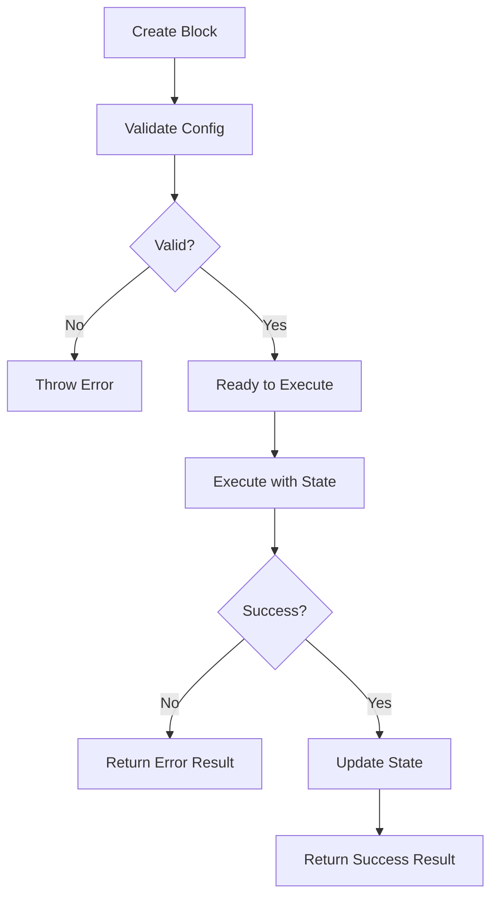

# 01 - Arquitectura de Agentes

**Versión**: 1.0
**Status**: 🔴 CRÍTICO - Leer antes de escribir código
**Tiempo de lectura**: 25 minutos

---

## 📋 ÍNDICE

1. [Visión General](#visión-general)
2. [Arquitectura Modular](#arquitectura-modular)
3. [Sistema de Bloques](#sistema-de-bloques)
4. [Tipos de Bloques](#tipos-de-bloques)
5. [Sistema de Conexiones](#sistema-de-conexiones)
6. [State Management](#state-management)
7. [Error Handling](#error-handling)
8. [Implementación Técnica](#implementación-técnica)
9. [Ejemplos de Uso](#ejemplos-de-uso)

---

## 👁️ VISIÓN GENERAL

### Qué es un "Agente" en este Sistema

```
Un AGENTE es un workflow autónomo compuesto por:
1. BLOQUES (Blocks) - Unidades de procesamiento
2. CONEXIONES (Connections) - Flujo de datos entre bloques
3. ESTADO (State) - Memoria del agente
4. CONFIGURACIÓN (Config) - Parámetros personalizables
```

### Analogía: Tuberías de Unix

```bash
# Un agente es como un pipeline de Unix:
cat input.txt | process | transform | output > result.txt

# En nuestro sistema:
InputBlock → LLMBlock → ToolBlock → OutputBlock
```

### Arquitectura de Alto Nivel

```
┌─────────────────────────────────────────────────────────┐
│                    AGENTE                                │
│                                                         │
│  ┌──────┐    ┌──────┐    ┌──────┐    ┌──────┐         │
│  │Input │───▶│ LLM  │───▶│ Tool │───▶│Output│         │
│  └──────┘    └──────┘    └──────┘    └──────┘         │
│     ▲           ▲          ▲            ▲              │
│     └───────────┴──────────┴────────────┘              │
│                  STATE                                   │
│                  (Shared Memory)                        │
└─────────────────────────────────────────────────────────┘
           ↕
        CONFIG
    (Parámetros)
```

---

## 🧱 ARQUITECTURA MODULAR

### Principio de Diseño

```yaml
composicion:
  "Cada agente es una composición de bloques"
  "Los bloques son independientes y reutilizables"
  "Los bloques se conectan mediante inputs/outputs"

encapsulamiento:
  "Cada bloque sabe solo lo que necesita saber"
  "Los bloques exponen una interfaz estándar"
  "Los bloques no dependen de otros bloques"

escalabilidad:
  "Agregar nuevos bloques sin modificar existentes"
  "Combinar bloques existentes en nuevos agentes"
  "Especializar bloques para casos específicos"
```

### Interfaz Universal de Bloques

```typescript
// Todo bloque implementa esta interfaz
interface Block {
  // Identificador único
  id: string;

  // Tipo de bloque (llm, tool, database, etc)
  type: BlockType;

  // Configuración del bloque
  config: BlockConfig;

  // Ejecutar el bloque
  execute(state: AgentState): Promise<BlockResult>;

  // Validar configuración
  validate(): ValidationResult;
}

// Resultado de ejecutar un bloque
interface BlockResult {
  success: boolean;
  data?: any;
  error?: Error;
  nextState?: Partial<AgentState>;
}

// Estado del agente (compartido entre bloques)
interface AgentState {
  input: string;              // Input original
  messages: Message[];         // Historial de conversación
  context: Record<string, any>; // Contexto adicional
  metadata: {
    startTime: number;
    tokensUsed: number;
    currentBlock: string;
  };
}
```

---

## 🧩 SISTEMA DE BLOQUES

### Jerarquía de Bloques

```
Block (Abstract Base)
├── InputBlock
├── ProcessBlock
│   ├── LLMBlock
│   ├── CodeBlock
│   └── TransformBlock
├── ToolBlock
│   ├── DatabaseBlock
│   ├── APIBlock
│   ├── FileSystemBlock
│   └── CustomToolBlock
└── OutputBlock
```

### Ciclo de Vida de un Bloque



---

## 📦 TIPOS DE BLOQUES

### 1. INPUT BLOCK

**Propósito**: Recibir y normalizar el input del usuario

```typescript
class InputBlock implements Block {
  id: string = 'input';
  type: BlockType = 'input';
  config: {
    schema: z.ZodSchema; // Validación de input
    preprocess?: (input: string) => string;
  };

  async execute(state: AgentState): Promise<BlockResult> {
    // 1. Validar input contra schema
    const validated = this.config.schema.parse(state.input);

    // 2. Pre-procesar si existe función
    const processed = this.config.preprocess
      ? this.config.preprocess(validated)
      : validated;

    // 3. Actualizar estado
    return {
      success: true,
      data: processed,
      nextState: {
        input: processed,
        'metadata.currentBlock': this.id,
      },
    };
  }
}
```

**Casos de Uso**:
- Validar formato de email
- Sanitizar input malicioso
- Extraer información estructurada
- Pre-procesamiento de texto

---

### 2. LLM BLOCK

**Propósito**: Llamar a un modelo de lenguaje

```typescript
class LLMBlock implements Block {
  id: string = 'llm';
  type: BlockType = 'llm';
  config: {
    provider: 'openai' | 'anthropic';
    model: string;
    temperature?: number;
    maxTokens?: number;
    systemPrompt?: string;
    promptTemplate: string; // Template con variables {{variable}}
  };

  async execute(state: AgentState): Promise<BlockResult> {
    // 1. Construir prompt desde template
    const prompt = this.interpolate(this.config.promptTemplate, state);

    // 2. Llamar al LLM
    const response = await this.callLLM({
      provider: this.config.provider,
      model: this.config.model,
      messages: [
        ...(this.config.systemPrompt
          ? [{ role: 'system', content: this.config.systemPrompt }]
          : []),
        ...state.messages,
        { role: 'user', content: prompt },
      ],
      temperature: this.config.temperature || 0.7,
      maxTokens: this.config.maxTokens || 2000,
    });

    // 3. Extraer tokens usados
    const tokensUsed = response.usage.totalTokens;

    // 4. Actualizar estado
    return {
      success: true,
      data: response.content,
      nextState: {
        messages: [
          ...state.messages,
          { role: 'user', content: prompt },
          { role: 'assistant', content: response.content },
        ],
        'metadata.tokensUsed': state.metadata.tokensUsed + tokensUsed,
        'metadata.currentBlock': this.id,
      },
    };
  }

  private interpolate(template: string, state: AgentState): string {
    // Reemplazar {{variable}} con valores del estado
    return template.replace(/\{\{(\w+)\}\}/g, (_, key) => {
      return state.context[key] || state[key as keyof AgentState];
    });
  }
}
```

**Casos de Uso**:
- Generación de texto
- Análisis de sentimiento
- Extracción de información
- Razonamiento complejo

---

### 3. TOOL BLOCK

**Propósito**: Ejecutar herramientas externas (APIs, databases, etc)

```typescript
class ToolBlock implements Block {
  id: string = 'tool';
  type: BlockType = 'tool';
  config: {
    toolType: 'database' | 'api' | 'filesystem' | 'custom';
    toolConfig: Record<string, any>;
    inputMapping: Record<string, string>; // Mapear input a parámetros
  };

  async execute(state: AgentState): Promise<BlockResult> {
    // 1. Obtener tool concreta
    const tool = this.getTool(this.config.toolType);

    // 2. Mapear input a parámetros
    const params = this.mapInput(state, this.config.inputMapping);

    // 3. Ejecutar tool
    try {
      const result = await tool.execute(params);

      return {
        success: true,
        data: result,
        nextState: {
          context: {
            ...state.context,
            [`${this.id}_result`]: result,
          },
          'metadata.currentBlock': this.id,
        },
      };
    } catch (error) {
      return {
        success: false,
        error: error as Error,
      };
    }
  }
}
```

**Subtipos de Tools**:

#### Database Tool
```typescript
class DatabaseTool {
  async execute(params: {
    query: string;
    database: string;
  }): Promise<any[]> {
    // Ejecutar query SQL
    // Retorna resultados
  }
}
```

#### API Tool
```typescript
class APITool {
  async execute(params: {
    url: string;
    method: 'GET' | 'POST' | 'PUT' | 'DELETE';
    headers?: Record<string, string>;
    body?: any;
  }): Promise<any> {
    // Hacer HTTP request
    // Retorna response
  }
}
```

**Casos de Uso**:
- Consultar base de datos
- Llamar APIs externas
- Leer/escribir archivos
- Ejecutar código arbitrario

---

### 4. OUTPUT BLOCK

**Propósito**: Formatear y entregar el resultado final

```typescript
class OutputBlock implements Block {
  id: string = 'output';
  type: BlockType = 'output';
  config: {
    format: 'text' | 'json' | 'markdown' | 'html';
    template?: string;
    postprocess?: (data: any) => any;
  };

  async execute(state: AgentState): Promise<BlockResult> {
    // 1. Extraer resultado del estado
    const result = this.extractResult(state);

    // 2. Formatear según configuración
    let formatted: any;
    switch (this.config.format) {
      case 'json':
        formatted = JSON.stringify(result, null, 2);
        break;
      case 'markdown':
        formatted = this.toMarkdown(result);
        break;
      case 'html':
        formatted = this.toHTML(result);
        break;
      default:
        formatted = result;
    }

    // 3. Aplicar template si existe
    if (this.config.template) {
      formatted = this.interpolate(this.config.template, {
        ...state,
        result: formatted,
      });
    }

    // 4. Post-procesar si existe
    if (this.config.postprocess) {
      formatted = this.config.postprocess(formatted);
    }

    return {
      success: true,
      data: formatted,
      nextState: {
        'metadata.currentBlock': this.id,
        'metadata.endTime': Date.now(),
      },
    };
  }
}
```

**Casos de Uso**:
- Formatear respuesta como JSON
- Generar Markdown
- Crear HTML
- Aplicar transformaciones finales

---

## 🔗 SISTEMA DE CONEXIONES

### Definición de Conexión

```typescript
interface Connection {
  id: string;
  from: string;    // ID del bloque origen
  to: string;      // ID del bloque destino
  condition?: (state: AgentState) => boolean; // Condicional
  transform?: (data: any) => any; // Transformar datos
}
```

### Tipos de Conexiones

#### 1. Conexión Simple
```typescript
{
  from: 'input',
  to: 'llm',
}
```
Flujo incondicional de un bloque a otro.

#### 2. Conexión Condicional
```typescript
{
  from: 'llm',
  to: 'database',
  condition: (state) => {
    return state.context.needsDatabase === true;
  },
}
```
Solo fluye si la condición se cumple.

#### 3. Conexión con Transformación
```typescript
{
  from: 'tool',
  to: 'output',
  transform: (data) => {
    return { formatted: JSON.stringify(data) };
  },
}
```
Transforma los datos antes de pasarlos.

---

### Grafo de Ejecución

```typescript
class AgentGraph {
  blocks: Map<string, Block>;
  connections: Connection[];

  constructor(blocks: Block[], connections: Connection[]) {
    this.blocks = new Map(blocks.map(b => [b.id, b]));
    this.connections = connections;
  }

  async execute(initialState: AgentState): Promise<AgentState> {
    let state = initialState;
    const executed = new Set<string>();

    // BFS traversal del grafo
    const queue: string[] = ['input'];

    while (queue.length > 0) {
      const blockId = queue.shift()!;

      // Evitar ciclos infinitos
      if (executed.has(blockId)) continue;
      executed.add(blockId);

      // Obtener bloque
      const block = this.blocks.get(blockId);
      if (!block) {
        throw new Error(`Block ${blockId} not found`);
      }

      // Ejecutar bloque
      const result = await block.execute(state);

      if (!result.success) {
        throw result.error;
      }

      // Actualizar estado
      state = { ...state, ...result.nextState };

      // Encontrar siguientes bloques
      const nextBlocks = this.connections
        .filter(c => c.from === blockId)
        .filter(c => !c.condition || c.condition(state))
        .map(c => c.to);

      queue.push(...nextBlocks);
    }

    return state;
  }
}
```

---

## 💾 STATE MANAGEMENT

### Diseño del Estado

```typescript
interface AgentState {
  // Input del usuario
  input: string;

  // Historial de conversación
  messages: Array<{
    role: 'system' | 'user' | 'assistant';
    content: string;
    timestamp?: number;
  }>;

  // Contexto adicional (key-value store)
  context: Record<string, any>;

  // Metadata de ejecución
  metadata: {
    startTime: number;
    endTime?: number;
    tokensUsed: number;
    costUsd: number;
    currentBlock: string;
    errors: Error[];
  };

  // Resultados intermedios
  intermediate: Record<string, any>;
}
```

### Inmutabilidad del Estado

```typescript
// El estado es INMUTABLE
// Cada bloque retorna un NUEVO estado
function updateState(
  currentState: AgentState,
  updates: Partial<AgentState>
): AgentState {
  return {
    ...currentState,
    ...updates,
    messages: [...(currentState.messages || []), ...(updates.messages || [])],
    context: { ...currentState.context, ...updates.context },
  };
}
```

### Persistencia del Estado

```typescript
class StateManager {
  async saveState(agentId: string, state: AgentState): Promise<void> {
    // Guardar en Redis
    await redis.setex(
      `agent:${agentId}:state`,
      3600, // 1 hora
      JSON.stringify(state)
    );
  }

  async loadState(agentId: string): Promise<AgentState | null> {
    // Cargar desde Redis
    const data = await redis.get(`agent:${agentId}:state`);
    return data ? JSON.parse(data) : null;
  }

  async resetState(agentId: string): Promise<void> {
    // Eliminar estado
    await redis.del(`agent:${agentId}:state`);
  }
}
```

---

## ⚠️ ERROR HANDLING

### Tipos de Errores

```typescript
enum ErrorType {
  VALIDATION = 'validation',    // Error de validación
  EXECUTION = 'execution',      // Error de ejecución
  TIMEOUT = 'timeout',          // Timeout
  RATE_LIMIT = 'rate_limit',    // Rate limit de API
  UNKNOWN = 'unknown',          // Error desconocido
}

class AgentError extends Error {
  type: ErrorType;
  blockId: string;
  recoverable: boolean;

  constructor(
    message: string,
    type: ErrorType,
    blockId: string,
    recoverable = true
  ) {
    super(message);
    this.type = type;
    this.blockId = blockId;
    this.recoverable = recoverable;
  }
}
```

### Estrategia de Manejo

```typescript
class ErrorHandler {
  async handle(error: AgentError, state: AgentState): Promise<BlockResult> {
    // 1. Loggear error
    logger.error(`Error in block ${error.blockId}:`, error);

    // 2. Determinar si es recuperable
    if (!error.recoverable) {
      // Error no recuperable - terminar ejecución
      return {
        success: false,
        error,
        nextState: {
          'metadata.errors': [...state.metadata.errors, error],
        },
      };
    }

    // 3. Intentar recuperar
    const recoveryResult = await this.attemptRecovery(error, state);

    if (recoveryResult.success) {
      return recoveryResult;
    }

    // 4. Si no se puede recuperar, retornar error
    return {
      success: false,
      error,
      nextState: state,
    };
  }

  private async attemptRecovery(
    error: AgentError,
    state: AgentState
  ): Promise<BlockResult> {
    switch (error.type) {
      case ErrorType.RATE_LIMIT:
        // Esperar y reintentar
        await delay(1000);
        return { success: true, data: null };

      case ErrorType.TIMEOUT:
        // Reintentar con timeout mayor
        return { success: true, data: null };

      case ErrorType.VALIDATION:
        // No se puede recuperar
        return { success: false, error };

      default:
        return { success: false, error };
    }
  }
}
```

---

## 💻 IMPLEMENTACIÓN TÉCNICA

### Estructura de Archivos

```
src/
├── blocks/
│   ├── base/
│   │   ├── Block.ts              # Clase base abstracta
│   │   ├── BlockResult.ts        # Tipo de resultado
│   │   └── BlockConfig.ts        # Configuración base
│   ├── implementations/
│   │   ├── InputBlock.ts
│   │   ├── LLMBlock.ts
│   │   ├── ToolBlock.ts
│   │   ├── DatabaseBlock.ts
│   │   └── OutputBlock.ts
│   └── registry.ts               # Registry de bloques
├── agents/
│   ├── Agent.ts                  # Clase base de agente
│   ├── AgentGraph.ts             # Grafo de ejecución
│   ├── AgentFactory.ts           # Factory pattern
│   └── StateManager.ts           # Manejo de estado
├── connections/
│   ├── Connection.ts             # Tipo de conexión
│   ├── GraphBuilder.ts           # Builder de grafos
│   └── ExecutionEngine.ts        # Motor de ejecución
├── tools/
│   ├── Tool.ts                   # Interfaz de tool
│   ├── DatabaseTool.ts
│   ├── APITool.ts
│   └── CustomTool.ts
├── utils/
│   ├── logger.ts
│   ├── errors.ts
│   ├── validators.ts
│   └── transformers.ts
└── types/
    ├── blocks.ts
    ├── agents.ts
    └── common.ts
```

### Instalación de Dependencias

```bash
# Core dependencies
npm install \
  langchain \
  @langchain/langgraph \
  @langchain/openai \
  @anthropic-ai/sdk \
  zod \
  uuid

# Dev dependencies
npm install -D \
  typescript \
  @types/node \
  vitest \
  eslint \
  prettier
```

### Configuración TypeScript

```json
// tsconfig.json
{
  "compilerOptions": {
    "target": "ES2022",
    "module": "ESNext",
    "moduleResolution": "bundler",
    "strict": true,
    "esModuleInterop": true,
    "skipLibCheck": true,
    "forceConsistentCasingInFileNames": true,
    "resolveJsonModule": true,
    "isolatedModules": true,
    "outDir": "./dist",
    "rootDir": "./src"
  },
  "include": ["src/**/*"],
  "exclude": ["node_modules", "dist", "tests"]
}
```

---

## 📚 EJEMPLOS DE USO

### Ejemplo 1: Agente Simple

```typescript
// Crear agente que llama a LLM y retorna resultado
const agent = new Agent({
  blocks: [
    new InputBlock({
      schema: z.object({ text: z.string() }),
    }),
    new LLMBlock({
      provider: 'openai',
      model: 'gpt-4',
      systemPrompt: 'Eres un asistente útil.',
      promptTemplate: '{{input}}',
    }),
    new OutputBlock({
      format: 'text',
    }),
  ],
  connections: [
    { from: 'input', to: 'llm' },
    { from: 'llm', to: 'output' },
  ],
});

// Ejecutar
const result = await agent.execute({
  input: 'Hola, ¿cómo estás?',
  messages: [],
  context: {},
  metadata: {
    startTime: Date.now(),
    tokensUsed: 0,
    costUsd: 0,
    currentBlock: '',
    errors: [],
  },
  intermediate: {},
});

console.log(result); // "¡Hola! Estoy bien, gracias por preguntar."
```

### Ejemplo 2: Agente con Tool

```typescript
// Agente que consulta base de datos
const agent = new Agent({
  blocks: [
    new InputBlock(),
    new LLMBlock({
      provider: 'openai',
      model: 'gpt-4',
      promptTemplate: 'Genera query SQL para: {{input}}',
    }),
    new ToolBlock({
      toolType: 'database',
      toolConfig: {
        connectionString: process.env.DATABASE_URL,
      },
    }),
    new OutputBlock({
      format: 'json',
    }),
  ],
  connections: [
    { from: 'input', to: 'llm' },
    { from: 'llm', to: 'tool' },
    { from: 'tool', to: 'output' },
  ],
});

const result = await agent.execute({
  input: 'Mostrar todos los usuarios activos',
  // ... resto del estado
});
```

### Ejemplo 3: Agente con Ramas Condicionales

```typescript
// Agente que toma diferentes caminos según input
const agent = new Agent({
  blocks: [
    new InputBlock(),
    new LLMBlock({ id: 'classifier', model: 'gpt-4' }),
    new LLMBlock({ id: 'calculator', model: 'gpt-4' }),
    new LLMBlock({ id: 'writer', model: 'gpt-4' }),
    new OutputBlock(),
  ],
  connections: [
    { from: 'input', to: 'classifier' },
    {
      from: 'classifier',
      to: 'calculator',
      condition: (state) => state.context.category === 'math',
    },
    {
      from: 'classifier',
      to: 'writer',
      condition: (state) => state.context.category === 'writing',
    },
    { from: 'calculator', to: 'output' },
    { from: 'writer', to: 'output' },
  ],
});
```

---

## ✅ CHECKLIST DE IMPLEMENTACIÓN

### Bloques Base

- [ ] `Block` clase abstracta implementada
- [ ] `InputBlock` funcional
- [ ] `LLMBlock` con OpenAI
- [ ] `LLMBlock` con Anthropic
- [ ] `ToolBlock` base
- [ ] `DatabaseTool` implementado
- [ ] `APITool` implementado
- [ ] `OutputBlock` con todos los formatos

### Sistema de Conexiones

- [ ] `Connection` tipo definido
- [ ] `AgentGraph` implementado
- [ ] Ejecución secuencial funcionando
- [ ] Condiciones implementadas
- [ ] Transformaciones implementadas

### State Management

- [ ] `AgentState` tipo definido
- [ ] Inmutabilidad garantizada
- [ ] `StateManager` con Redis
- [ ] Serialización/deserialización

### Error Handling

- [ ] `AgentError` clase implementada
- [ ] `ErrorHandler` funcionando
- [ ] Estrategias de recuperación
- [ ] Logging de errores

### Tests

- [ ] Unit tests para cada bloque
- [ ] Integration tests para agentes
- [ ] E2E tests para workflows
- [ ] Test coverage > 80%

---

## 📚 RECURSOS ADICIONALES

### Documentación

- LangGraph: https://langchain-ai.github.io/langgraph/
- LangChain: https://js.langchain.com/
- OpenAI API: https://platform.openai.com/docs/api-reference
- Anthropic API: https://docs.anthropic.com/

### Patrones Relacionados

- Chain of Responsibility
- Strategy Pattern
- Factory Pattern
- Observer Pattern (para eventos)

---

## 🔄 PRÓXIMO PASO

Una vez comprendida esta arquitectura:

```bash
# Leer implementación del agente de contabilidad
cat ~/agent-wrapping-plan/fase-1-fabricacion-motores/02-agente-contabilidad.md

# O comenzar a implementar
cd ~/agent-core
npm install
# ... empezar a codear
```

---

**¿Preguntas? Revisar la documentación de LangGraph o preguntar al equipo.**

🎯 **Meta final de esta fase**: Tener un sistema modular donde agregar nuevos bloques sea tan simple como implementar una interfaz.
